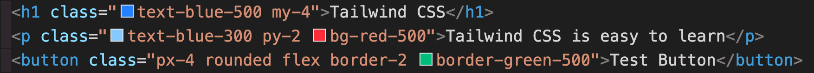

**What is Tailwind CSS ?**

A CSS framework which eliminates the need of CSS in our code by implementing all the styles through utility classes in markup.

**Example:**

 

**Output:**

Here in the utility classes,

 
<li>mt => margin-top</li>
<li>py => padding y-axis (both top and bottom)</li>
<li>text-blue => color:blue;</li>
<li>flex => display:flex;</li>
<li>rounded => border-radius: 0.25rem;</li>
 

**Why is it so special ?**

It is highly flexible and customizable when compared to other CSS frameworks which makes the sites styling looks unique whereby not making 2 sites looking almost similar.

It comes with default mobile-first approach. But with the help of utility classes, complex responsive layouts can be built easily by applying breakpoints.

Since using utility classes for styling, it is almost like inline styling rather than writing normal CSS with selector, property and value.  This saves time and increases productivity.

If we don't want to mess up our markup, we can extend all the utility classes through a single CSS sheet in src folder by the help of directives.

<strong>Example :</strong> Consider an h1 element with a class name "testHeader"

For applying styles to the h1 element, extend the utility classes from main CSS file by mentioning as below:

.testHeader {
    @apply text-red-500 py-4 mx-2 bg-white-500
}

 

Here @apply is the directive which plays the key role in applying the styles.

We can introduce hover state functionalties also.
 
 

.testHeader:hover {
    @apply text-red-500 py-4 mx-2 bg-white-500
}

 
 
 
<em>Writing in progress....Please check later.</em>

