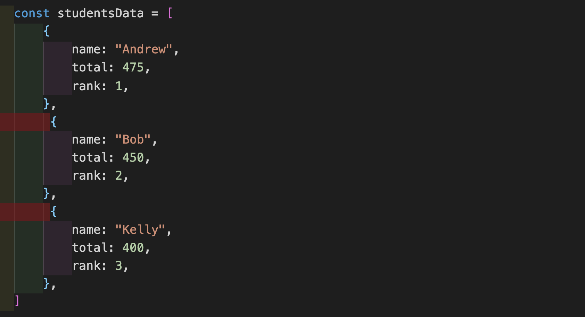
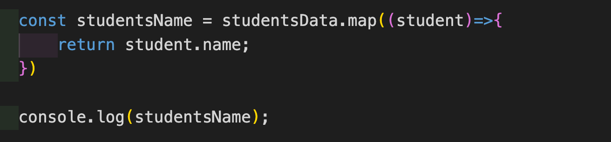
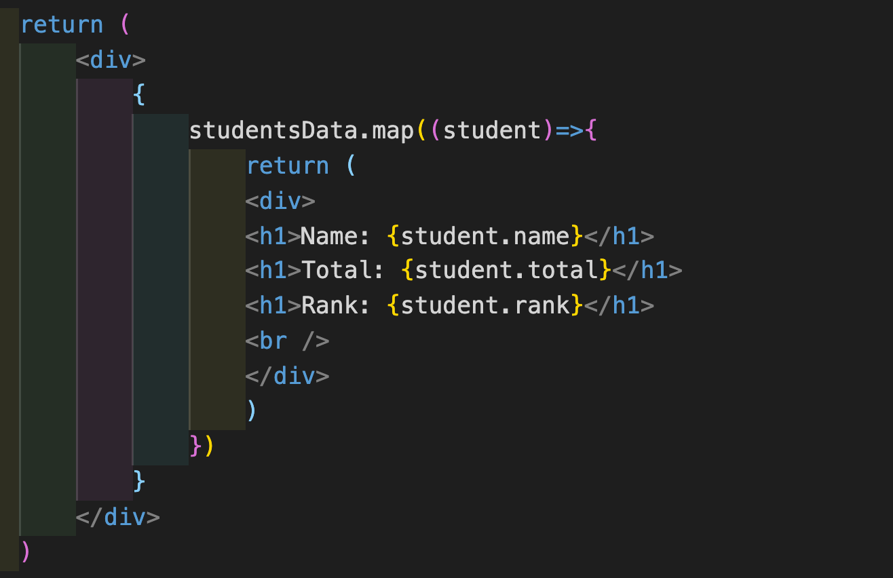
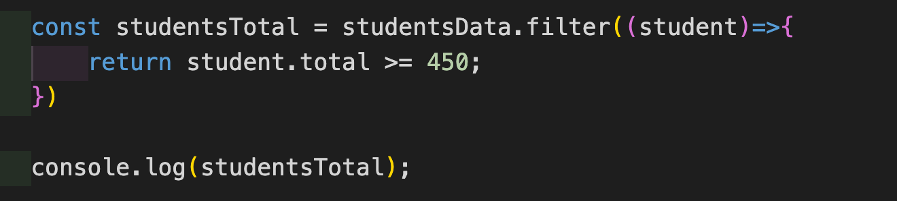
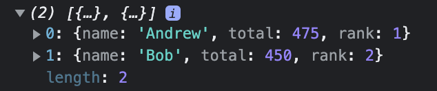
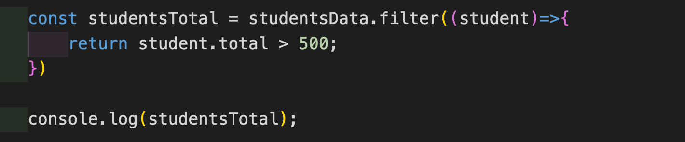
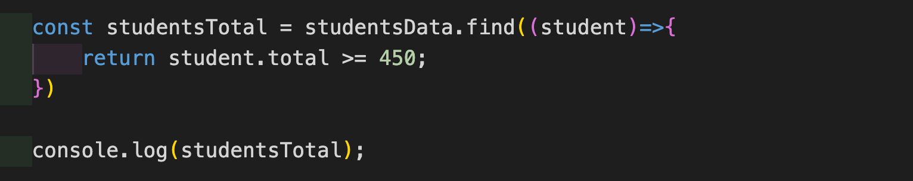
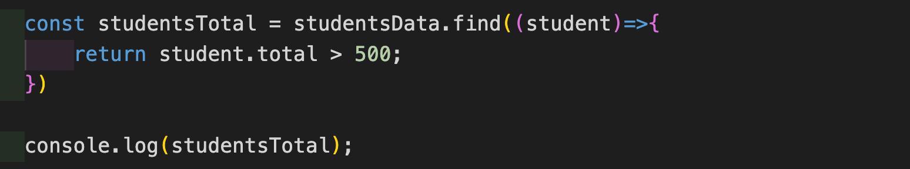

**JavaScript - Array methods**

JavaScript provides us many useful methods to iterate over array and to return the desired values. Here, we will cover the following most commonly used array methods:

 

<li>Map</li>

<li>Filter</li>

<li>Find</li>

 

Lets use the following data as example through out the blog.

 

 

 

**Map:**

Map method returns a new array after completing the iteration in the original array.

It completely uses the original array for making the new one, so length of the new array will be the same as the original one.

 

**Example:**

 

 

**Output:**

 

**['Andrew', 'Bob', 'Kelly']**

 

 

Here "student" in code denotes the current iteration in the original array. It can be named anything. For example: item, value, test ...

Using map method, the iterated values can be easily displayed on the web pages by wrapping it in HTML.

 

**Example:**

 

 

**Output:**

 

 

**Filter:**

Filter returns a new array only if the condition provided on the return statement is true.

Since it returns based on the condition, unlike "Map" method, the new array size won't be the same as the originl one.

 

**Example:**

 

 

**Output:**

 

 

 

If there are no matches for the provided condition in return statement, filter method will return empty array.

 

**Example:**

 

 

**Output:**

 

**[ ]**

 

 

**Find:**

Find method is almost similar to filter method. But it won't return an array. Instead it will return a single instance.

It will return the result only if the condition provided on the return statement is true.

But if there are multiple matches for the provided condition, Find method will return the first match.

 

**Example:**

 

 

**Output:**

 

**{name: "Andrew", total: 475, rank: 1}**

 

If there are no matches for the provided condition, then Find method will return **"undefined"** as value.

 

**Example:**

 

 

**Output:**

 

**undefined**

 

Find method will be the best if we want to get a single result from an array of unique values.

 

 

Thus JavaScript made our task easier and simpler for iterating over array and to get the desired output with the help of above discussed array methods.

 

Please write your valuable comments / suggestions to <a href="mailto:kabilansakthi97@gmail.com">kabilansakthi97@gmail.com</a>