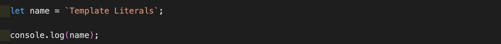
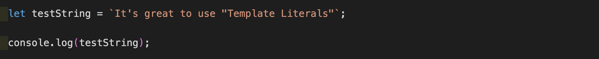
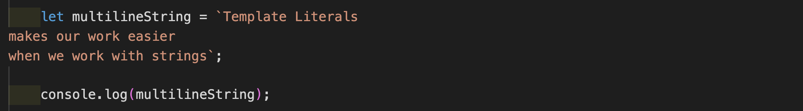
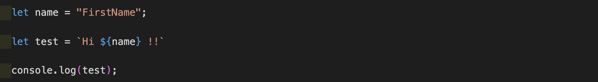
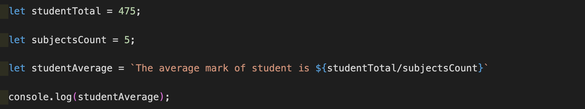

**Template Literals**

It makes our job easier when we work with strings (also multiline strings) and can perform string interpolation.

Often, we could come across words called "Template Strings" and "String Templates". All are same because before ES6, template literals were called as **"Template Strings"**.

 

**Syntax:**

Usually, we used to wrap strings with single ('string') or double quotes ("string"). But with the introduction of template literals, we will be wrapping strings with **back-tick** ( ` ).

 

**Example:**

 

 

**Output:**

 

 

If we wrap our string with template literals, we can use both single and double quotes in our string without providing escape sequence.

 

 

**Output:**

 

 

**Multiline strings**

With the introduction of template literals, we can create a multiline string by wrapping it inside backticks without providing **escape sequence \n.**

 

 

**Output:**

 

 

**Note:** The whitespace in between the string are considered as part of the string.

 

**String interpolation**

The way of interpolating variables and expression into strings is called as string interpolation. It acts like a placeholder in strings substitution and will automatically replace the variables and expression into values in strings.

 

**Syntax:**

${...}

**String interpolation with variables**

 

 

**Output:**

 

 

**String interpolation with expression**

 

 

**Output:**

 

 

Thus template literals helps us work in a cool manner when dealing with multiline strings and provides the useful concept of string interpolation.

 

Please write your valuable comments / suggestions to <a href="mailto:kabilansakthi97@gmail.com">kabilansakthi97@gmail.com</a>

